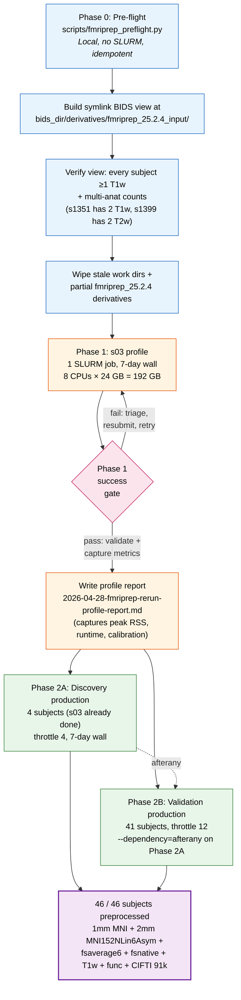
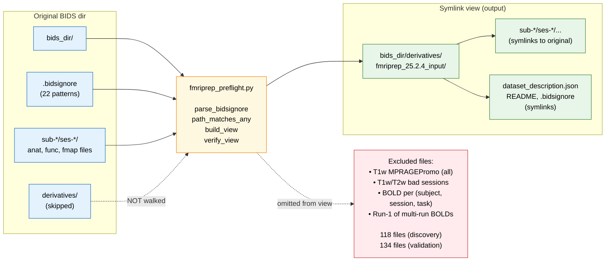
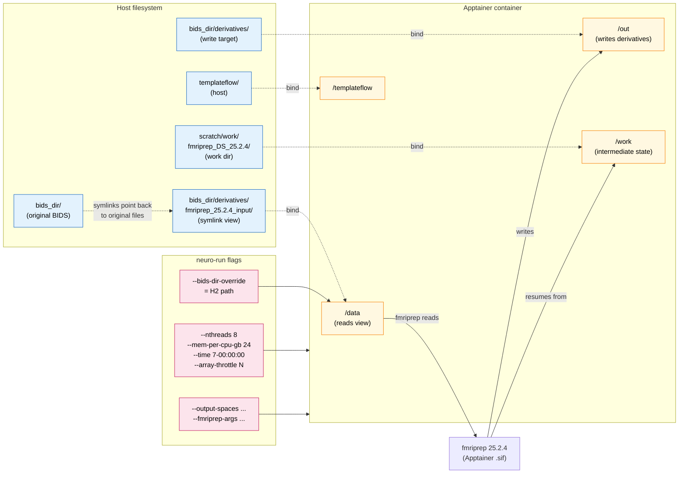
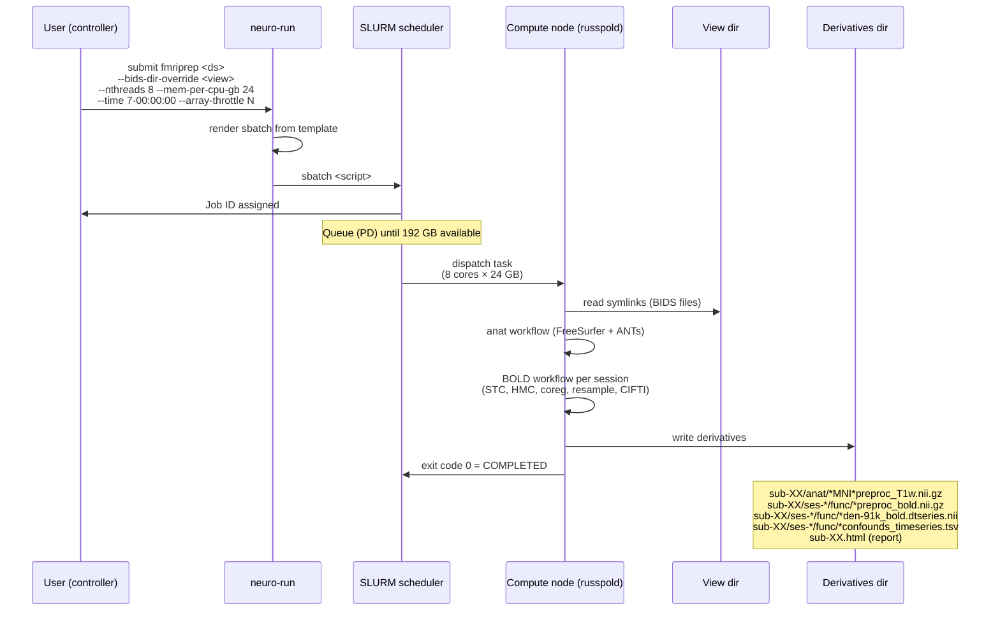
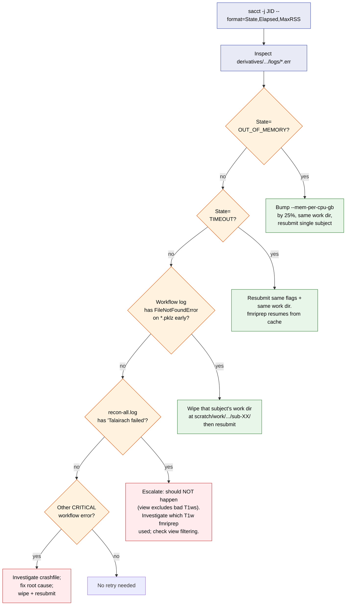
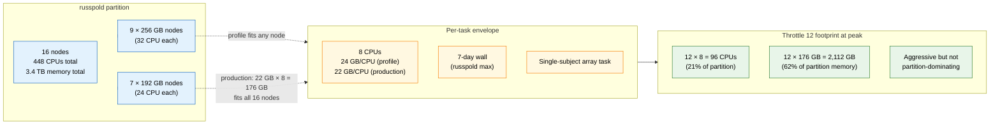
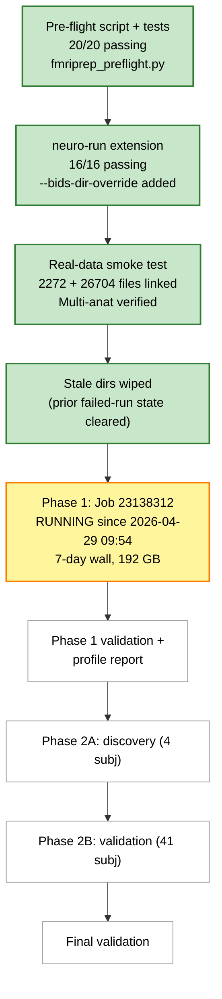

# fMRIPrep 25.2.4 Rerun — Pipeline Visualization

**Companion to:** `2026-04-28-fmriprep-rerun-design.md` and `../plans/2026-04-28-fmriprep-rerun.md`

This document visualizes the data flow, phase sequencing, and triage logic of the fmriprep 25.2.4 rerun pipeline. Diagrams use Mermaid syntax and render natively in GitHub-flavored Markdown.

---

## 1. End-to-end pipeline overview

---

## 2. Pre-flight: `.bidsignore` → symlink view

The pre-flight script translates `.bidsignore` patterns (which pybids ignores) into a parallel symlink directory that fmriprep reads as if it were the BIDS dataset.

### Multi-anat handling (per `docs/EXCLUSIONS.md`)

Two validation subjects intentionally retain multiple anatomical scans for fmriprep to average:

| Subject | T1w retained | T2w retained | Reason |
|---------|--------------|--------------|--------|
| s1351 | ses-01 + ses-08 | ses-01 only | Both T1w SagMPRAGE clean |
| s1399 | ses-02 only | ses-01 + ses-02 | Both T2w CubePromo decent |

The view contains both anat files for these subjects; fmriprep's default behavior averages them into a per-subject template. `verify_view` asserts the expected counts (`{"s1351": {"T1w": 2}, "s1399": {"T2w": 2}}`) so a regression in `.bidsignore` parsing would fail the pre-flight before any SLURM job is submitted.

---

## 3. fmriprep input / output topology with `--bids-dir-override`

`--bids-dir-override` binds the symlink view as `/data` (input) and binds the registered BIDS dir's `derivatives/` as `/out` (output). Without the override, `/data/derivatives` would point inside the view, causing nested output paths.

**Key invariant:** Even though fmriprep sees the view as its BIDS root, the original BIDS dir is never mutated — symlinks point back into it read-only, and outputs land at the registered BIDS dir's `derivatives/`, *not* under the view.

---

## 4. Per-subject SLURM job flow (Phase 1 + Phase 2)

Each subject's fmriprep job follows the same shape. Phase 1 is one job (s03); Phase 2A is an array of 4; Phase 2B is an array of 41.

---

## 5. Failure triage decision tree

If a SLURM task ends in any state other than COMPLETED, the operator follows this decision tree before resubmitting.

---

## 6. Resource and throttling map

---

## 7. Wall-time projection

| Phase | Job count | Wall (per job) | Throttle | Cumulative wall (worst case) |
|-------|-----------|----------------|----------|------------------------------|
| Phase 0 (pre-flight) | n/a (local) | minutes | n/a | day 0 |
| Phase 1 (s03 profile) | 1 | ≤7 days | n/a | day 0–7 |
| Phase 2A (discovery) | 4 | ≤7 days | 4 | day 7–14 |
| Phase 2B (validation) | 41 | ≤7 days | 12 | day 14–35 |

**Best case:** ~2-3 weeks total (typical subjects finish in 3-5 days).
**Worst case:** ~5 weeks (multiple subjects need 7-day resume).
**Most likely:** 3-4 weeks total.

Phase 2B starts via `--dependency=afterany:$DISCOVERY_JID`, so validation queues immediately when Phase 2A's array task IDs all reach a terminal state (success or failure). `afterany` (not `afterok`) means a single discovery failure does not block the validation phase — that subject is triaged manually while the rest of the work proceeds.

---

## 8. Status as of 2026-04-29 09:55

| Task | Status | Detail |
|------|--------|--------|
| 1–5: Pre-flight script | ✅ | TDD; 20 tests passing |
| 6: neuro-run `--bids-dir-override` | ✅ | TDD; 16 tests passing |
| 7: Real-data smoke test | ✅ | Both views built and verified |
| 8: Wipe stale dirs | ✅ | Done after `sqlb` confirmed no active jobs |
| 9: Submit Phase 1 (s03 profile) | ✅ | Job 23138312 running on `sh03-06n11` |
| 10: Phase 1 validation + profile report | ⏳ | Waits for Job 23138312 to complete |
| 11: Phase 2A (discovery production) | ⏳ | Pending Phase 1 success |
| 12: Phase 2B (validation production) | ⏳ | Pending Phase 2A submission |
| 13: Daily monitoring + triage | ⏳ | Ongoing during production |
| 14: Final validation | ⏳ | After all 46 subjects complete |
